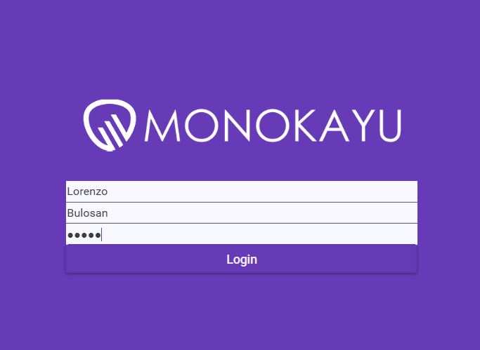

# Product_Revision_Manager

Tier 3 app in WPF with internal SQL server that aims to solve the communication between clients and suppliers in an organized manner.



### Table of contents :star:

2. Project Goal
2. Installation Manual
4. Example Code
5. Sprint Retrospective
6. Kanban board

### Project Goal

The goal is the project is to create an App in WPF to manage the communication of product revisions between clients and suppliers

**DOD** :100:

The project will be deemed as done when the App to manage revision is functional and implements CRUD operations on at least 2 link tables and implements WPF frontend.

#### Installation manual :page_facing_up:

**Pre-requisites**

Download the repository 

You can open the solution with Visual Studio and make sure you have the following downloaded using Nugget package manager:

- Nunit
- Entity Framework Core
- Entity Framework Tools
- Entity Framework SQL Server
- Material Design UI library

**Step 1** Set up project

Open Visual Studio into the solution "ProductRevisionManager.sln"

**Step 2** Migrate tables

Open PowerShell on Visual Studio and apply migrations 

* Add-Migration MigrationNameHere

* Update-Database

These commands will create a database called Monokayu and tables derived from the models

**Step 3** Generate test data

Run the business layer main method i.e. Change the dropdown box to "BussinessManager" and run console application

* This will generate Test data
  * Users
    * Lorenzo Bulosan
    * Cathy French
    * Martin Beard
  * Projects
    * Calculator
    * Radio
    * Revision Manager

**Step 4** WPF app

Run the WPF app by changing the dropdown box to select "ProductRevisionAppWPF" and run console application

You can now login with one of the 3 users described on Step 3

Test data login credentials:

* name = Lorenzo
* surname = Bulosan
* password = 12345

### Example Code

**Method for retrieving projects assigned to a user using a joining table**

``` c#
// Obtain projects given a userID and return dictionary of projectID, projectName
public Dictionary<int, string> GetProjectsFromUserID(int userID)
{
    using (var db = new MonokayuDbContext())
    {
        var commentsFromUser = from u in db.Users2
            join up in db.UserProjects on u.UserID equals up.userID
            join p in db.Projects2 on up.projectID equals p.ProjectID
            where u.UserID == userID
            select new
        {
            p.ProjectID,
            p.projectName
        };

        return commentsFromUser.ToDictionary(p => p.ProjectID, p => p.projectName);
    }
}
```

Method developed to query two tables with a many to many relationship over joining table. The method returns a dictionary and it is used to populate a combo box that has to contain a selection of available projects for that specific user. Another user should be able to enter the same project and a user can have many projects therefore it is important that the two models User/Projects have to be related in a many-to-many relationship.

### Sprint Retrospectives :eye_speech_bubble:

**Sprint 1** (05/02/2021-09/02/2021)

*<u>Goal</u>*

The goal for this sprint was to design a database and test the relationship between the tables, as well as displaying the test data on WPF frontend. 

The goals for the sprint were achieved and the database was design to 3NF (Normal Form) and they were implemented on a model first basis using Entity Framework in C#.

The test data (Task for a revision) are displayed using a template. A way to change between revision rounds was also achieve using a combo box that allows users to select a revision round and retrieve the specific tasks for that round.

*<u>Retrospective</u>*

- What worked well?
  - Visual representation of ERD before making the models
  - Testing each table relation before proceeding to create all models at once
  - Often pushing work to GitHub (allowed me to restore the migrations when bad migrations happened) 
- What did not work well?
  - The content of user stories needed previous work so It is needed to either break down the card or create the card for which this one is dependent to. 
  - Unit test were not done immediately
  - Documentation was not written immediately
- What actions can I take to improve the process going forward?
  - Write Unit tests every few methods that are written.
  - Write documentation more often
  - Clean code from test methods

**Sprint 2 **(09/02/2021-11/02/2021)

*<u>Goal</u>*

The goal for this sprint was to design a database was to create the UI for adding tasks and developing the methods for updating the database the correct tables. another goal was to leave ready the UI for creating comments and adding revisions but no methods behind and applying the UI library Theme called Material Design.

The goal for the sprint was achieved and the UI theme was installed, Not all test were implemented and a blocker was that I wanted the test data to be erased so after inserting and deleting the ID counter would still go up and I did not want to end up with large values after deleting the table so a lot of time was given to find a way to delete the test data when doing tests.

*<u>Retrospective</u>*

- What worked well?
  - Creating UI as well as the functionality together allows for progress on both ends
  - UI library speeds up the design as it already looks good out of the box with minimal change in styling
- What did not work well?
  - Getting stuck on finding how to remove test data and leave the database a somewhat cleaner spent too much time while I could have done more tests instead of halting the tests.
- What actions can I take to improve the process going forward?
  - Prioritizing the important part which is the tests instead of removing the test data which although important it is less effective use of my time.

**Sprint 3 **(11/02/2021-12/02/2021)

*<u>Goal</u>*

The goal for this sprint was to implement the methods that I left the UI ready for (updating, comments and adding revisions) as well as making a simple login page with no registration and complete the unit tests

The goal for the sprint was achieved and methods were implemented for updating tasks, adding comments and a simple login. There was also minor UI changes and handling data from the backend to UI and completed the unit tests.

It was also achieve writing methods for generating test data for when forking this repository (See instructions on previous section).

*<u>Retrospective</u>*

- What worked well?
  - Having set up the UI yesterday meant that I could focus on functionality as I already seen the user experience.
  - Generating test data for for empty databases allows to not having to worry of always setting up the database (instructions in the above sections)
- What did not work well?
  - Having to change one table relationship to many-to-many could have been done earlier in the start when designing, this took a fair amount of time to change so that I could achieve the functionality needed.
- What actions can I take to improve the process going forward?
  - Revise the database design and revise it again for the future

#### Kanban board

The board can be seen if navigating to the tab "Projects" and the state of each board can be seen under the folder "Images"